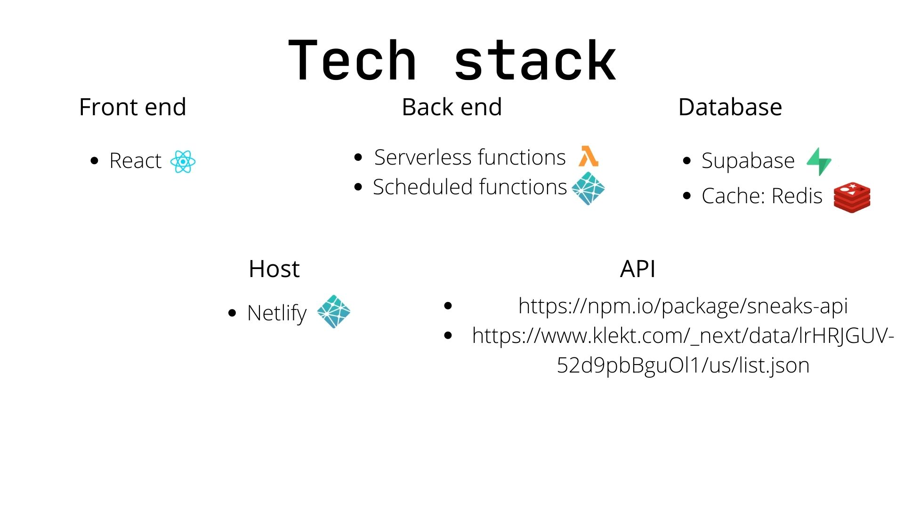

# Sneakerscanner
## What does our application do?
Sneakers reselling is a growing business online.
As far as we know, the current market is splitted between multiple vendors online, each using its own website or hosted on different websites.
Our idea is to create a web app able to quickly search for a sneaker on multiple website and provide the user with the best offers currently available. 
These websites are often hard to find, and sparse over the internet, our app would reunite all of the offers in a simple web interface, leading the users to the original website for purchase.

## How is it different from a CRUD app?
It needs to interface with multiple APIs from different websites, probably mantain a real-time database to speed up queries, and allow the user to receive notifications throught mail if a certain item is found.
The user has also the possibility to create a list of favourite sneakers, and receive notification via mail if the price of those items changes. 

## Security and privacy
While our web app would not have sensitive data, it should keep the users accounts and the vendor data secure.

## Link to the site
[Sneakerscanner](https://fluffy-dusk-8cf61e.netlify.app/)

## Tech stack diagram

## Minimum viable product
The first version of our app will offer the following features:
- Home page showing a table, each cell of the table dysplay a sneaker
- Clicking on a sneaker opens another page with a description of the sneaker and links to the sites that purchase it with the cost
- Navbar allows to login and to search for a sneaker